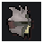
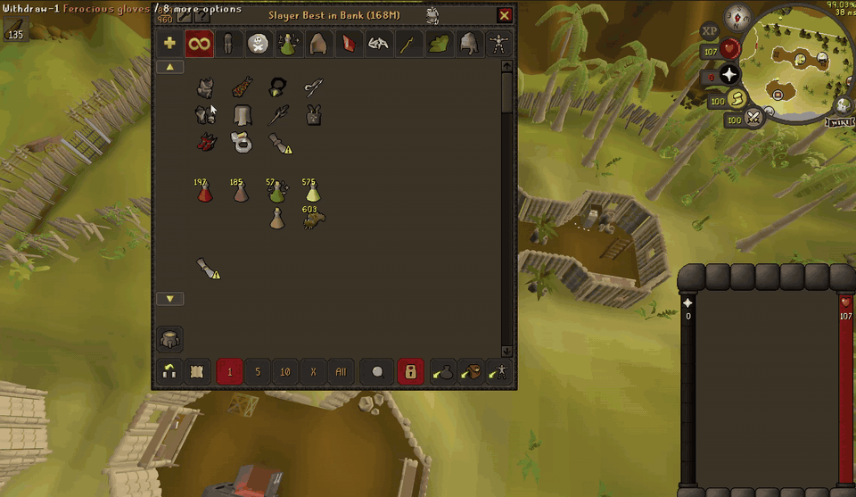
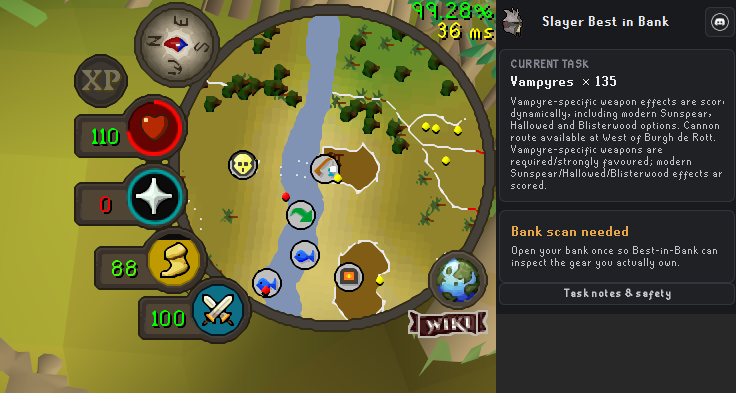
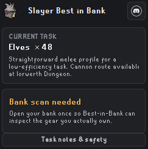
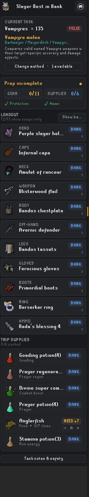
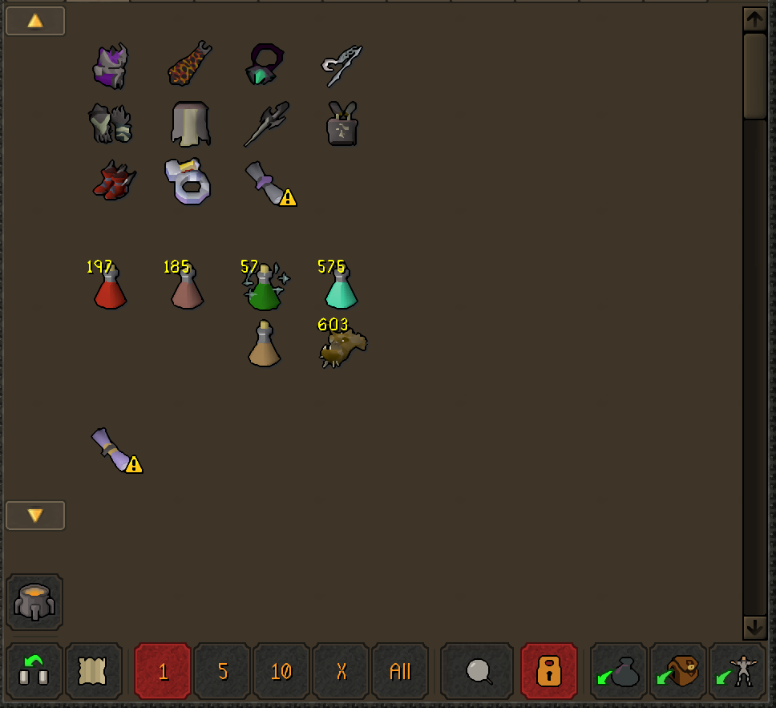
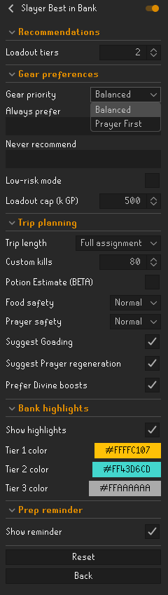
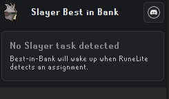

<p align="center">
  
</p>

<h1 align="center">Slayer Best in Bank</h1>

<p align="center">
  <strong>Turn your current Slayer assignment and the items you own into a complete, bank-ready trip.</strong>
</p>

<p align="center">
  Task-aware gear · Coherent loadout tiers · Supply estimates · Fast manual bank prep
</p>

Slayer Best in Bank is a RuneLite loadout assistant built for the question every
Slayer task starts with: **what should I bring from my bank?**

It reads the active assignment, evaluates the gear and supplies currently known
to the client, and builds a practical setup for the selected combat method. You
still make every withdrawal, equipment change, and gameplay decision yourself.

<p align="center">
  
</p>

<p align="center">
  <em>A stable four-column path keeps equipment in a predictable click order from bank to inventory.</em>
</p>

## Why use it?

| | |
|---|---|
| **Built from your bank** | Recommends valid gear you actually own across the bank, inventory, and worn equipment instead of handing you a generic shopping list. |
| **Aware of the task** | Accounts for the assigned monster, location, selected method, required protection, useful attack styles, and supported special weapon families. |
| **A complete setup** | Builds coherent equipment, ammunition, task tools, potions, food, Prayer support, cannon supplies, and other trip essentials together. |
| **Fast to prepare** | Offers focus views, a locked bank-session plan, inventory-capacity fitting, stable manual positions, quantity badges, optional highlights, and readiness reminders. |

## From assignment to ready

### 1. Get a task

The sidebar wakes up when RuneLite detects an active Slayer assignment. It shows
the target, remaining amount, selected method, and the task-specific reasoning
behind that choice.

<p align="center">
  
</p>

### 2. Open the bank once

Best in Bank needs one bank scan before it can evaluate account-specific gear.
The sidebar clearly tells you when that scan is still needed—no silent guesswork.

<p align="center">
  
</p>

### 3. Review the loadout and supplies

After the scan, the sidebar presents the selected equipment, where each item is
currently located, preparation progress, and the supplies planned for the trip.
Missing quantities are called out before you leave.

<p align="center">
  
</p>

### 4. Prepare at your pace

Open the Best-in-Bank bank view and withdraw the recommendation manually. Tier 1
equipment and trip supplies use separate four-column paths. Once an item is
withdrawn, its position stays reserved so the next target does not jump beneath
your mouse.

Every interaction remains a normal player click. The plugin does not withdraw,
equip, move, attack, pray, or otherwise play the game for you.

## Preparation controls

The sidebar's preparation controls keep long loadouts manageable:

- **All** shows the complete plan while packed entries remain visible in a
  quieter style.
- **Missing** shows only gear and enabled supplies that still need attention.
- **Gear** and **Supplies** isolate one part of the trip.
- Combined readiness shows packed entries and the planned inventory footprint
  in one line.

Opening the bank locks the active loadout for that bank session. Withdrawals
continue to update packed and banked status, but task, method, or setting changes
wait behind a visible `Refresh` action. This keeps equipment, supplies, and bank
positions predictable while you click through the plan.

After a prepared bank exit, the plugin silently remembers the supplies packed
for that trip. Drinking potions, eating food, or placing the cannon therefore
does not turn normal consumption into a new preparation warning. Opening a bank
starts a fresh preparation check; required worn equipment continues to use live
inventory and equipment state throughout the trip.

The inventory-capacity guard reserves space for the current inventory, pending
Tier 1 equipment withdrawals, and remaining supply withdrawals. When a plan
would exceed 28 slots, it reduces optional food and secondary supply quantities
first. Required protection, tools, and supplies are never silently removed; if
they still cannot fit, the sidebar shows the remaining over-capacity warning.

## Recommendations that stay coherent

Tier 1 is the strongest complete setup the solver can build from the items you
own. Tier 2 and Tier 3 begin with that setup and introduce useful fallback swaps
instead of mixing unrelated per-slot rankings.

- Changing a ranged weapon rebuilds compatible ammunition.
- Changing between one-handed and two-handed weapons rebuilds the off-hand.
- Mandatory Slayer protection remains in place.
- `Always prefer` items remain protected when they are valid for the method.
- `Never recommend` items are excluded.
- Low-risk constraints continue to apply across alternative tiers.
- Higher tiers display only the pieces that differ from the stronger setup.

Supported recommendations include melee, ranged, Magic, Ancient multi-target
methods, Venator setups, and cannon-aware trips where the task profile supports
them.

## Trip planning that scales with the task

Plan for the full remaining assignment, a shorter trip of up to 40 kills, or a
custom kill count. The planner can estimate:

- Divine and regular combat boosts;
- Bastion and ranging potions;
- Goading potions;
- Prayer regeneration potions;
- a strict Prayer potion or Super restore preference for Prayer sustain;
- food;
- antifire and venom protection;
- run-energy support;
- Rune pouch preparation;
- cannonballs;
- Slayer tools and finishing items, including Crystal chimes for warped creatures;
- optional Expeditious or Slaughter bracelet switches.

**Potion Estimate (BETA)** adds quantity targets based on the remaining kills,
trip length, combat method, and supply preferences. Turning it off removes the
estimated counts without removing useful potion recommendations.

Real consumption varies with stats, gear, Prayer use, kill speed, incoming
damage, and location. Treat all supply quantities as a starting point, not a
guarantee.

## Make it yours

The plugin is designed to adapt to different accounts, budgets, and trip styles.

| Setting | What it controls |
|---|---|
| **Loadout tiers** | Build one, two, or three coherent owned setups. |
| **Gear priority** | Choose Balanced or Prayer First scoring. |
| **Always prefer** | Strongly favor valid item-name matches. |
| **Never recommend** | Exclude item-name matches from the solver. |
| **Low-risk mode** | Cap the estimated combined value of the complete Tier 1 equipment setup. |
| **Trip length** | Plan for the full assignment, a short trip, or a custom kill count. |
| **Food / Prayer safety** | Use Light, Normal, or Extra automatic supply estimates. |
| **Supply preferences** | Toggle Goading, Prayer regeneration, Divine boosts, and an Expeditious or Slaughter bracelet switch. |
| **Teleport preferences** | Choose owned home, spell, Slayer-ring, fairy-ring, and Kourend travel options, including Max cape and Dramen staff. |
| **Bank highlights** | Enable normal-bank markers and choose colors for each tier. |
| **Prep reminder** | Show or hide the reminder after leaving the bank underprepared. |

Each adjustable supply also has task-specific decrease, Auto, and increase
controls in the sidebar. Optional supplies can be disabled for one task and
restored later. RuneLite stores those preferences with the RuneScape profile.

<table>
  <tr>
    <td width="75%" align="center" valign="top">
      
    </td>
    <td width="25%" align="center" valign="top">
      
    </td>
  </tr>
  <tr>
    <td align="center"><em>Equipment first, supplies second, with predictable spacing.</em></td>
    <td align="center"><em>Loadout, trip, highlight, and reminder controls.</em></td>
  </tr>
</table>

## Low-risk mode

Low-risk mode limits the estimated combined GE guide value of the entire Tier 1
equipment setup. It does not apply the configured cap to every item separately.

Required protection and explicitly preferred items are hard overrides. If an
override exceeds the cap by itself, the remaining slots use the strongest
lower-value choices available rather than silently dropping the requirement.

Guide prices are estimates and are not a guarantee of replacement cost or
Wilderness safety.

## Installation

1. Open RuneLite.
2. Open **Configuration** and select **Plugin Hub**.
3. Search for **Slayer Best in Bank**.
4. Install the plugin and enable it.
5. Get a Slayer assignment, then open your bank once to build the first
   account-specific recommendation.

The plugin also handles quiet states clearly: it waits when no assignment is
detected and asks for a bank scan when it does not yet know what you own.

<p align="center">
  
</p>

## Privacy and player control

Task information, item state, equipment, recommendations, and settings are
processed inside the RuneLite client. Slayer Best in Bank does not upload bank
contents, task information, account names, chat, or generated loadouts to the
plugin author.

The Discord icon in the sidebar opens the
[Slayer Best in Bank support community](https://discord.gg/HU67cBGBnt) in your
system browser only after you click it. The plugin does not contact Discord in
the background.

Slayer Best in Bank is advisory only. It does not automate inputs or perform
gameplay actions.

## Known limitations

- Recommendations use curated combat rules and heuristics, not a full damage
  simulator.
- Not every niche set bonus, boss mechanic, inventory strategy, or unusual item
  interaction is modeled.
- Location-specific advice depends on the task location available through
  RuneLite.
- Potion and food quantities are estimates and may need personal adjustment.
- Inventory capacity is a conservative preparation estimate; unrelated items
  already carried can reduce the available space until they are banked.
- A bank scan is required before account-specific recommendations are possible.
- The plugin does not provide combat automation, prayer-switch instructions, or
  boss-mechanic prediction.

Detailed task coverage is documented in:

- [Combat task coverage](COMBAT-TASK-COVERAGE.md)
- [Cannon task coverage](CANNON-TASK-COVERAGE.md)
- [Slayer master coverage](SLAYER-MASTER-COVERAGE.md)

## Feedback and support

Found an odd recommendation or have an idea? Use the repository's
[bug report template](.github/ISSUE_TEMPLATE/bug_report.md),
[feature request template](.github/ISSUE_TEMPLATE/feature_request.md), or the
[support Discord](https://discord.gg/HU67cBGBnt).

For recommendation reports, include the task and location, selected method,
relevant combat levels, expected setup, and actual setup. Crop screenshots to
the relevant plugin area and do not share credentials or unrelated account
information.

## Development

This repository uses RuneLite's standalone external-plugin structure, targets
Java 11 bytecode, and uses the standard Plugin Hub build type.

```shell
./gradlew test
./gradlew run
```

On Windows:

```powershell
.\gradlew.bat test
.\gradlew.bat run
```

The `run` task launches a RuneLite developer client with the plugin loaded. See
the [validation checklist](VALIDATION.md) and
[release notes](RELEASE-NOTES.md) for the current release-candidate details.

## License

Slayer Best in Bank is licensed under the
[BSD 2-Clause License](LICENSE).
