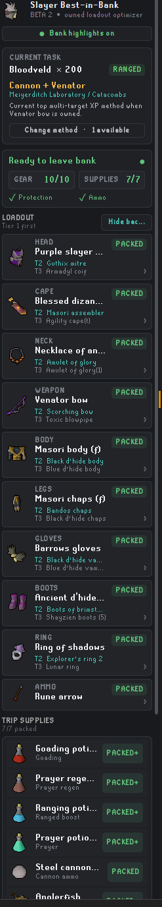
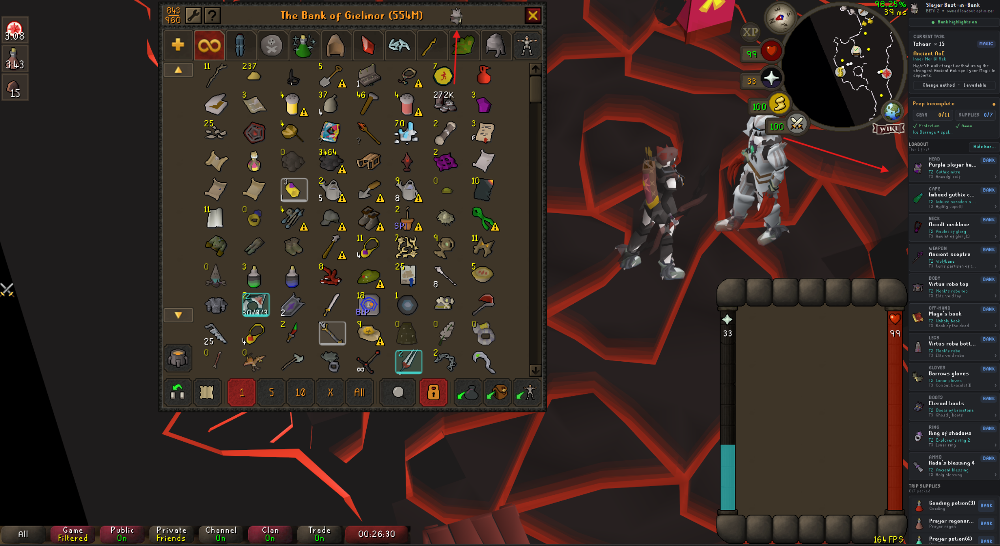
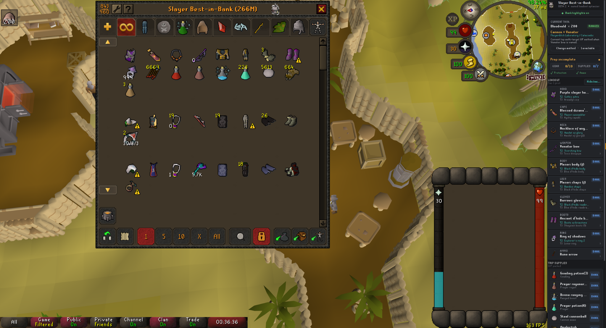
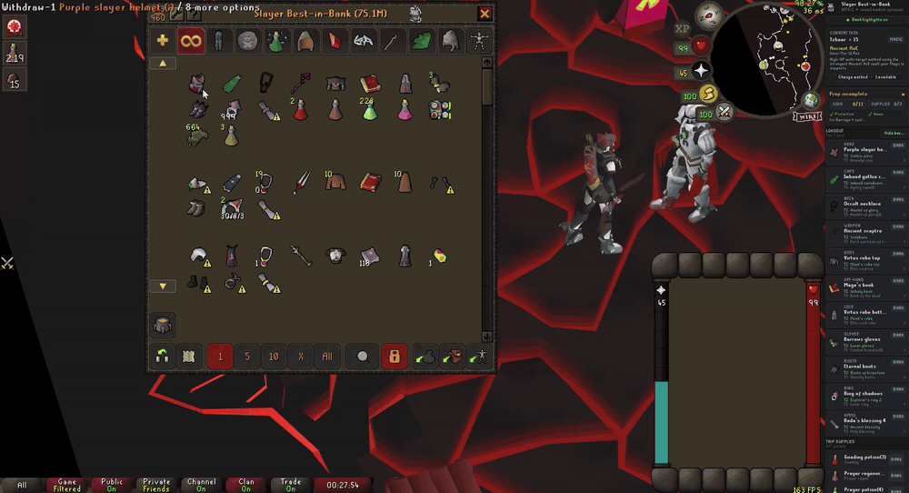
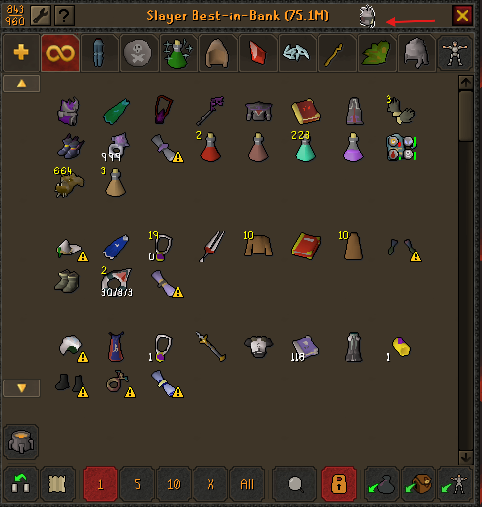
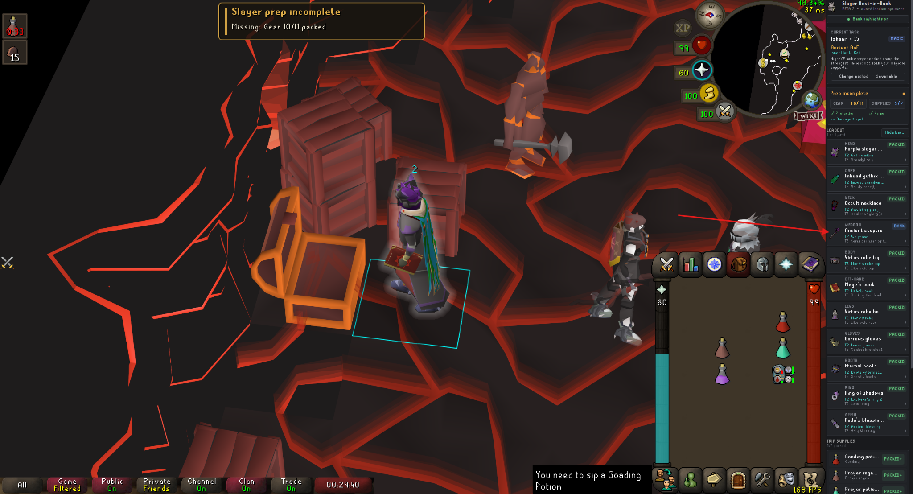
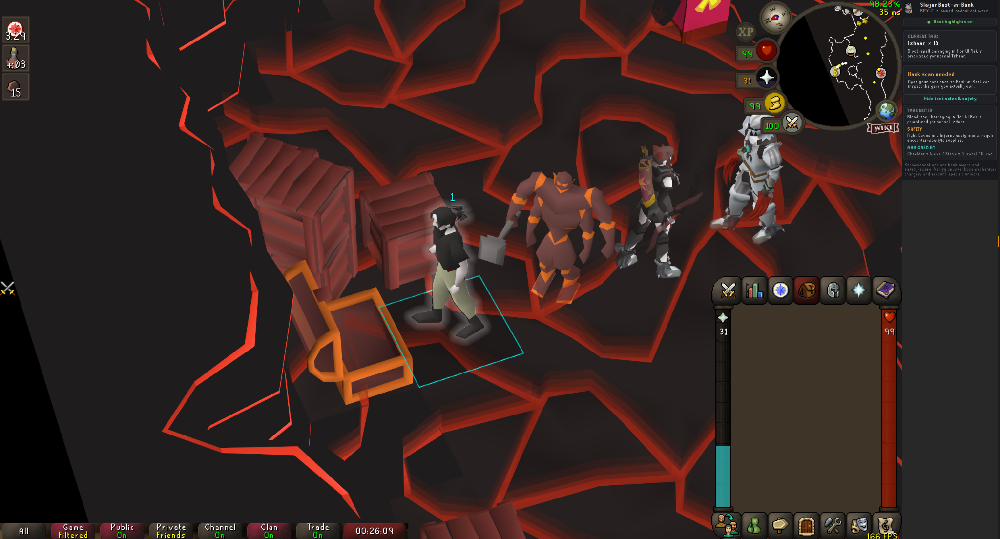
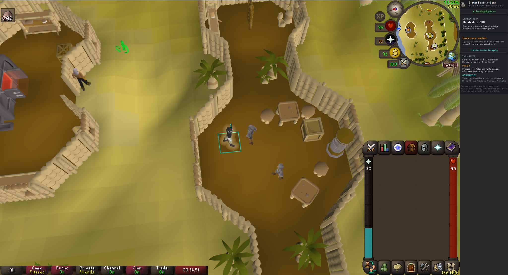
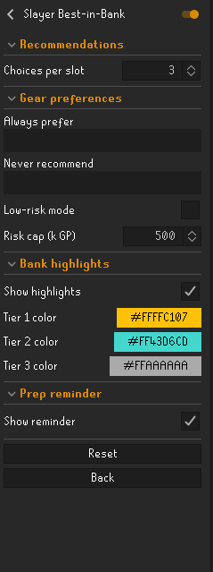

# Slayer Best-in-Bank

**Stop looking at theoretical BiS. Gear for the Slayer task with what you actually own.**

Slayer Best-in-Bank is a task-aware RuneLite loadout assistant that reads your current Slayer task and the gear/supplies available to your account, then builds a coherent setup you can actually take out of the bank.

It is designed around one question:

> **What is the best Slayer setup I can make from my bank right now?**

<p align="center">
  
</p>

> **Beta:** This repository contains the public beta being prepared for RuneLite Plugin Hub review. Recommendations are advisory only. The plugin never withdraws, equips, clicks, attacks, or performs gameplay actions for the player.

## Why Best-in-Bank?

Traditional gear guides are useful when you own everything on the list. Slayer Best-in-Bank solves a different problem: it works from **your bank, your account, and your current task**.

The plugin combines:

- current Slayer assignment;
- combat style and eligible task methods;
- bank, inventory, and equipped items;
- combat levels;
- mandatory Slayer protection;
- weapon/off-hand/ammo compatibility;
- relevant diary state;
- owned consumables and utility supplies;
- user gear preferences and optional risk limits.

The result is a practical **Tier 1 loadout**, owned alternatives, supplies, and a clear answer to whether you're ready to leave the bank.

## Task-aware smart logic

Best-in-Bank does not use one generic equipment formula for every monster. Curated tasks can select the method that makes sense for the assignment.

| Ancient Magicks / AoE task | Cannon + Venator task |
| --- | --- |
|  |  |

### Barrage / Burst logic

For eligible multi-target Magic tasks, the plugin can:

- recognize the Ancient Magicks strategy;
- check the active spellbook and usable AoE spell tier;
- build a Magic-focused owned loadout;
- validate the resulting weapon/off-hand setup;
- surface rune-pouch and rune-related preparation;
- recommend useful task supplies such as **Goading potions**, **Prayer regeneration potions**, prayer/restores, food, and run-energy support when applicable;
- track those supplies as they move from the bank into your inventory.

### Cannon + Venator logic

Where a ranged multi-target approach is appropriate, Best-in-Bank can build around:

- **Venator bow** ownership;
- compatible ammunition;
- ranged offensive gear;
- cannon/cannonball support where the task strategy calls for it;
- ranged boosts;
- prayer sustain;
- food and utility supplies.

The method card tells you what strategy is currently selected, and eligible curated tasks can expose alternate methods through **Change method**.

### Cannon-aware task routing

Best-in-Bank maintains a location-aware cannon catalog instead of assuming that a monster is cannonable everywhere it appears. The beta.3 catalog contains **81 verified cannon routes** across low-level, high-level, Wilderness, Venator, and barrage-oriented Slayer tasks.

- **Smoke devils** use a **Barrage + cannon lure** method: the cannon pulls the room while Burst/Barrage clears the stack.
- Location-locked tasks only offer cannon when the assigned area supports it. For example, Dagannoth in the Lighthouse, Jormungand's Prison, or Waterbirth Island Dungeon can show cannon, while Catacombs Dagannoth will not.
- Mixed-location tasks such as Bloodveld, Dust devils, Waterfiends, Wyrms, Shades, and Metal dragons use explicit allowed routes instead of a blanket yes/no flag.
- When cannon is selected, the **Cannon base, stand, barrels, and furnace become Tier 1 loadout gear**. Cannonballs stay in Trip Supplies.
- The GEAR readiness counter includes all four cannon parts, so the trip cannot appear gear-complete while part of the cannon is still banked.
- Regular and ornamented cannon components are treated as separate complete sets; Best-in-Bank will not mix them.

See [CANNON-TASK-COVERAGE.md](CANNON-TASK-COVERAGE.md) for the full embedded route catalog.

## Tiered owned gear

Best-in-Bank builds **coherent Tier 1 / Tier 2 / Tier 3 choices**, instead of scoring every equipment slot in isolation.



Important behavior:

- Tier 1 represents the preferred owned setup.
- Withdrawing Tier 1 does **not** cause Tier 2 to steal the Tier 1 recommendation.
- Inventory and equipped gear remain part of the active owned loadout while you gear.
- Tier 2 / Tier 3 stay available as real fallback choices.
- Two-handed weapons cannot be paired with an impossible off-hand.
- Mandatory Slayer protection can override a higher raw-stat item when safety requires it.
- Ranged recommendations validate common weapon/ammo relationships.
- **Always prefer** and **Never recommend** let you influence the optimizer.
- **Low-risk mode** can filter high-value equipment above a configurable GP cap.

## Bank-integrated gearing

The bank is part of the workflow rather than a separate checklist.



Best-in-Bank can:

- highlight recommended equipment in the normal bank;
- color-code Tier 1 / Tier 2 / Tier 3;
- open a dedicated **Slayer Best-in-Bank** filtered bank view;
- keep task supplies together with the primary setup;
- track whether each recommendation is **BANK**, **PACKED**, **PACKED+**, or **MISSING**;
- keep stackable consumables visible while more remain in the bank;
- avoid raw/burnt food when selecting trip food.

The player remains fully in control: every withdrawal and equipment action is manual.

## Smart trip supplies

Gear is only part of Slayer preparation. Supply recommendations change with the selected task/method and what the account actually has available.

Depending on the assignment, Best-in-Bank can consider:

- Goading potions;
- Prayer regeneration potions;
- Prayer potions / Super restores / Sanfew-style prayer support;
- combat-style boosting potions;
- food;
- stamina / run-energy support;
- Rune pouch and rune preparation;
- cannonballs;
- antifire;
- anti-venom;
- Slayer finishing items and task tools;
- task-specific protection or utility.

The goal is not to prescribe a fixed inventory for every player. It is to surface useful owned supplies that support the **selected method and efficient task uptime**.

## Readiness tracking

The sidebar continuously summarizes trip preparation:

- **Gear** packed
- **Supplies** packed
- **Protection** valid
- **Ammo** valid
- spellbook / AoE spell readiness where applicable



If the bank closes while important preparation is incomplete, Best-in-Bank can show a compact RuneScape-style reminder instead of letting the missing item silently disappear from the workflow.

## Before the bank scan

The plugin can recognize the active task and intended method before it has inspected the current bank.

| TzHaar — Ancient AoE | Bloodveld — Cannon + Venator |
| --- | --- |
|  |  |

Opening the bank gives Best-in-Bank the owned-item snapshot needed to build the account-specific setup.

## Safety and compatibility logic

A statistically strong item is not useful when the resulting setup is invalid.

Best-in-Bank includes guardrails for:

- 2H weapon vs. off-hand conflicts;
- common ranged weapon/ammo compatibility;
- mandatory shields and protection equipment;
- Slayer helmets/facemasks, earmuffs, spiny helmets, Slayer gloves, insulated boots, Witchwood icons and similar task requirements;
- wyvern protection;
- Karuulm heat protection, including Kourend Elite diary handling;
- dragonfire protection interactions;
- active Ancient Magicks spellbook and level requirements;
- required task tools/supplies.

When a mandatory requirement cannot be satisfied, the plugin is designed to mark the trip **not ready** rather than quietly presenting an unsafe setup as complete.

## Slayer master coverage

The embedded catalog includes task pools for the current master families used by the plugin:

- Turael / Aya
- Spria
- Mazchna / Achtryn
- Vannaka
- Chaeldar
- Konar quo Maten
- Nieve / Steve
- Duradel / Kuradal
- Krystilia

Specialized profiles provide richer method/safety behavior where available. Recognized assignments without a specialized profile fall back to a generic owned-gear optimizer instead of becoming unusable.

See [SLAYER-MASTER-COVERAGE.md](SLAYER-MASTER-COVERAGE.md) for the embedded task mapping.

## Configuration



Available controls include:

- number of choices per equipment slot;
- **Always prefer** item matching;
- **Never recommend** item matching;
- optional low-risk mode;
- configurable risk cap;
- bank highlighting toggle;
- custom Tier 1 / Tier 2 / Tier 3 highlight colors;
- bank-close preparation reminder.

## Design principles

### Owned first
Recommendations are based on what the account can actually use now, not a theoretical shopping list.

### Coherent setup
A loadout must work together as a set. Individual slot scores do not override weapon, ammo, shield, or mandatory-protection constraints.

### Method aware
Barrage/Burst, Venator, cannon-assisted, melee, ranged, and other curated methods can require different equipment and supplies.

### Manual gameplay
Best-in-Bank is a planning and UI plugin. It does not automate withdrawals, equipment changes, movement, combat, or other gameplay actions.

## Development

This repository follows RuneLite's standalone external-plugin structure and targets Java 11.

```shell
./gradlew test
./gradlew run
```

On Windows:

```powershell
.\gradlew.bat test
.\gradlew.bat run
```

The `run` task launches a RuneLite developer client with the plugin loaded.

## Beta / bug reports

This is a public beta. If you find a recommendation that looks wrong, please include:

- Slayer task
- selected method
- relevant combat levels
- expected item/setup
- actual recommendation
- screenshot of the sidebar/bank if possible

Use the repository's **Bug report** issue template so task-specific edge cases can be reproduced and fixed quickly.

## License

Slayer Best-in-Bank is licensed under the BSD 2-Clause License. See [LICENSE](LICENSE).
