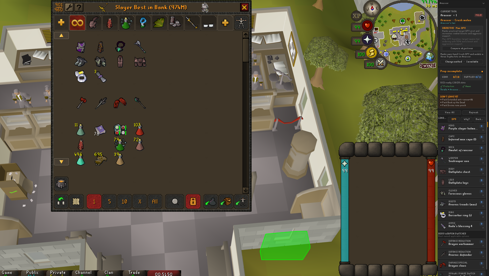
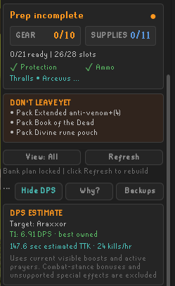
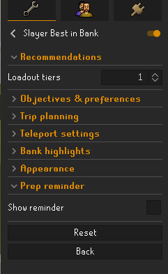
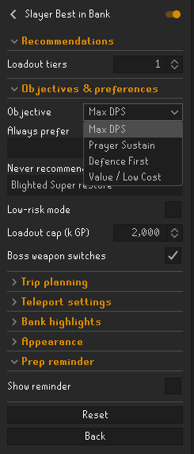
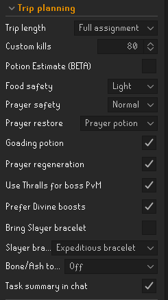
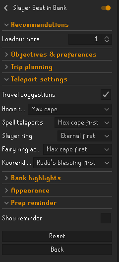
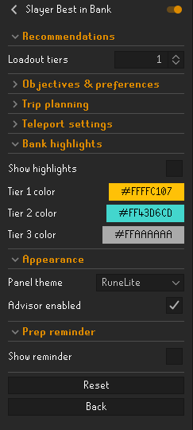

<p align="center">
  
</p>

<p align="center"><em>Smart task detection builds the strongest valid setup from your bank and keeps required protection, ammunition, and encounter switches together.</em></p>

## One task. One complete plan.

Slayer Best in Bank turns the assignment RuneLite detects and the items you
already own into a coherent, bank-ready loadout. It recommends equipment,
compatible ammunition, useful switches, protection, and supplies while leaving
every withdrawal and gameplay decision in your hands.

## Why players use it

| Smart recommendations | Complete preparation |
|---|---|
| Detects the task, location, and selected combat method. | Plans gear, ammunition, switches, food, potions, tools, and travel. |
| Ranks equipment you actually own instead of showing a generic shopping list. | Tracks what is equipped, packed, banked, or still missing. |
| Enforces weapon/ammo compatibility and mandatory Slayer protection. | Fits optional supplies around the 28-slot inventory limit without dropping required items. |
| Supports task-aware Objectives, preferences, and Low-risk limits. | Locks the bank plan while preparing so items do not jump around after every withdrawal. |

## Real-time DPS and TTK estimates

Target-aware estimates compare complete owned loadouts using current visible
boosts, active prayers, equipment bonuses, attack speed, target defences, and
supported weapon or set effects. For standard elemental spells, this includes
the matching elemental amulets' hidden +2 base max hit.

<p align="center">
  
</p>

The expandable DPS view keeps the normal task panel compact while providing:

- estimated DPS or a range across target variants;
- estimated time to kill and kills per hour;
- Tier 1, Tier 2, and Tier 3 comparisons;
- the combat method or supported effect being modeled;
- clear notes when a stance, charge state, or special effect cannot be observed.

These figures are planning estimates, not a replacement for encounter-specific
mechanics or the full OSRS Wiki DPS calculator.

## Make every task yours

The settings are grouped by purpose so the controls you need stay easy to find.

<table>
  <tr>
    <td width="33%" align="center" valign="top">
      <br>
      <strong>Customization</strong><br>
      Loadout tiers and clearly grouped settings.
    </td>
    <td width="33%" align="center" valign="top">
      <br>
      <strong>Objectives</strong><br>
      Max DPS, Prayer Sustain, Defence First, or Value / Low Cost.
    </td>
    <td width="33%" align="center" valign="top">
      <br>
      <strong>Trip planning</strong><br>
      Assignment length, safety levels, boosts, Prayer support, and optional supplies.
    </td>
  </tr>
</table>

<table>
  <tr>
    <td width="50%" align="center" valign="top">
      <br>
      <strong>Teleport routing</strong><br>
      Choose preferred home, spell, Slayer-ring, fairy-ring, and Kourend travel options for GPS / Shortest Path integration.
    </td>
    <td width="50%" align="center" valign="top">
      <br>
      <strong>Appearance and reminders</strong><br>
      Configure bank highlights, tier colors, panel theme, and the preparation reminder.
    </td>
  </tr>
</table>

### Objectives and explanations

Choose how the plugin balances a task:

- **Max DPS** prioritizes target-aware damage and offensive support.
- **Prayer Sustain** favors Prayer bonus and longer Prayer trips.
- **Defence First** favors total defence and additional food.
- **Value / Low Cost** keeps DPS-valid gear while reducing optional expense.

The sidebar can suggest an Objective for the current method, compare all four,
apply the suggestion, and restore your previous choice. The optional **Why?**
view explains the stats, task rules, passives, and preferences behind primary
and backup recommendations.

### Trip planning and cost

Plan the full assignment, a short trip, or a custom number of kills. Food,
Prayer, boosts, protection, cannon ammunition, and optional support scale with
the task and your selected safety levels.

When enough information is visible, the sidebar estimates total trip cost and
GP per planned kill from GE guide prices. Supported ammunition and Magic casts
are included; hidden quiver state, unknown charges, loot, and unsupported costs
are not guessed.

After leaving the bank, the plugin can record observed modeled-supply usage and
show one compact task summary when the assignment ends or changes.

### Presets and personal rules

- **Always prefer** strongly favors valid matching items.
- **Never recommend** excludes matching items.
- **Low-risk mode** caps the estimated value of the complete Tier 1 loadout
  while preserving required safety gear.
- Versioned `SBIB1` presets can share the method, Objective, item preferences,
  trip settings, safety levels, and Low-risk policy.

## How preparation works

1. Get a Slayer assignment.
2. Open your bank once so the plugin can evaluate what you own.
3. Review the selected method, Objective, gear, switches, and supplies.
4. Use **All**, **Missing**, **Gear**, or **Supplies** to focus the sidebar.
5. Withdraw and equip everything manually through the highlighted bank view.

Opening the bank locks the current plan. Live withdrawals still update packed
and banked status, but task, method, or setting changes wait for **Refresh** so
the owned selection and bank positions remain stable while you prepare.

## Installation

1. Open RuneLite and select **Configuration**.
2. Open **Plugin Hub**.
3. Search for **Slayer Best in Bank**.
4. Install and enable the plugin.
5. Get an assignment and open your bank once.

## Privacy and player control

Task information, item state, equipment, recommendations, and settings are
processed locally inside RuneLite. Slayer Best in Bank does not upload bank
contents, account names, chat, task information, or generated loadouts.

The plugin is advisory only. It does not withdraw items, equip gear, invoke menu
actions, switch prayers, attack NPCs, or automate gameplay. Clipboard access
occurs only after you click a preset Copy or Import button. The Discord support
invite opens only after you click the sidebar support icon.

## Limitations

- DPS and supply quantities are estimates and can require personal adjustment.
- Not every niche special attack, set bonus, boss phase, or inventory strategy
  is modeled.
- Location-specific guidance depends on the assignment information RuneLite
  exposes.
- A bank scan is required before account-specific recommendations are possible.
- Guide prices are estimates and are not guarantees of replacement cost or
  Wilderness safety.

Coverage details:

- [Combat task coverage](COMBAT-TASK-COVERAGE.md)
- [Cannon task coverage](CANNON-TASK-COVERAGE.md)
- [Slayer master coverage](SLAYER-MASTER-COVERAGE.md)

## Feedback and support

Report unexpected recommendations through the
[bug report template](.github/ISSUE_TEMPLATE/bug_report.md), submit ideas through
the [feature request template](.github/ISSUE_TEMPLATE/feature_request.md), or
join the [support Discord](https://discord.gg/HU67cBGBnt).

For recommendation reports, include the task, location, selected method,
relevant combat levels, expected setup, and actual setup. Do not share account
credentials or unrelated personal information.

## Development

This repository follows RuneLite's standalone external-plugin structure and
targets Java 11 bytecode.

```shell
./gradlew test
./gradlew run
```

Windows:

```powershell
.\gradlew.bat test
.\gradlew.bat run
```

See the [validation checklist](VALIDATION.md) and
[release notes](RELEASE-NOTES.md) for the current release status.

## License

Slayer Best in Bank is licensed under the
[BSD 2-Clause License](LICENSE).
